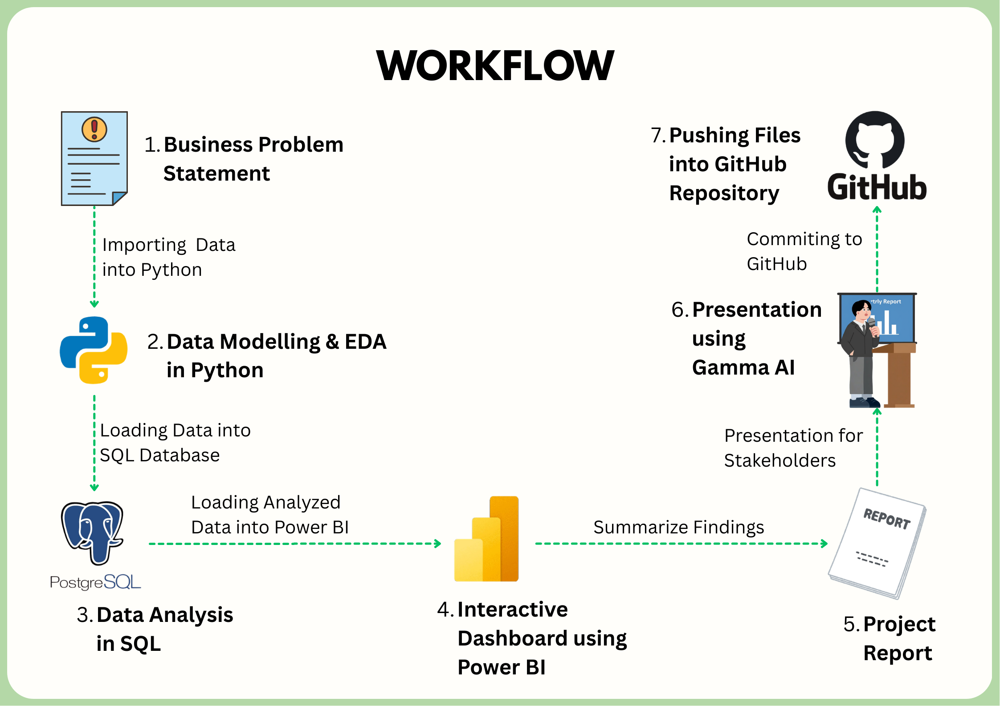
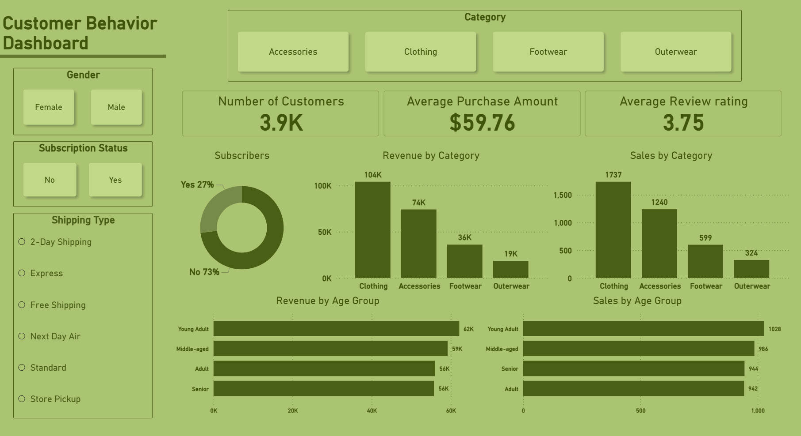

# Customer Shopping Behavior Analysis Project

## Executive Summary
This project demonstrates a complete data analytics lifecycle, transitioning from raw data to actionable business intelligence. By integrating **Python** for data engineering, **SQL** for deep-dive analysis, and **Power BI** for visualization, the project identifies key drivers of retail revenue. Key findings include the high value of the "Young Adult" demographic and the discovery that repeat buyers are not yet fully converted to the subscription model, providing a clear path for targeted marketing interventions.

## Objective
The primary goal is to leverage customer shopping data to identify trends, improve customer engagement, and optimize marketing strategies. Specifically, the project aims to:
* Segment customers based on loyalty and purchasing patterns.
* Analyze the impact of discounts and shipping types on total spend.
* Provide a centralized dashboard for stakeholders to track KPIs in real-time.

## Data Source
* **Dataset:** Customer Shopping Behavior Dataset.
* **Content:** Contains 3,900 records of customer transactions including demographics (age, gender), purchase details (amount, category, item), and behavioral data (frequency, review ratings, subscription status).

## Tech Stack
* **Data Manipulation:** Python (Pandas, NumPy)
* **Database:** PostgreSQL (Data storage and complex querying)
* **Visualization:** Power BI (Interactive Dashboards)
* **Reporting:** Microsoft Word & Gamma AI (Presentation Deck)
* **Environment:** Jupyter Notebook / PGAdmin 4

## Project Workflow
| Workflow |
| :--- |
|  |

1. **Data Cleaning & Feature Engineering (Python):**
    * Handled missing values in `review_rating` using category-specific medians.
    * Standardized column names to `snake_case` for SQL compatibility.
    * Created `age_group` and converted textual frequency into numeric `purchase_frequency_days`.
2. **SQL Analysis:**
    * Performed customer segmentation into "New," "Returning," and "Loyal" categories.
    * Ranked top products per category using Window Functions (`ROW_NUMBER`).
    * Analyzed revenue distribution across demographics.
3. **Power BI Dashboard:**
    * Developed measures for Total Revenue, Average Spend, and Rating.
    * Built an interactive interface with slicers for Subscription Status, Gender, and Category.

## Key Business Insights
* **Demographic Power:** Young Adults are the leading revenue contributors.
* **Shipping Impact:** Customers opting for Express shipping have a higher average purchase amount than Standard users.
* **Subscription Gap:** A significant portion of "Loyal" customers (repeat buyers) are not yet subscribers, indicating a major upsell opportunity.

## Preview
| Final Dashboard Preview |
| :--- |
|  |
